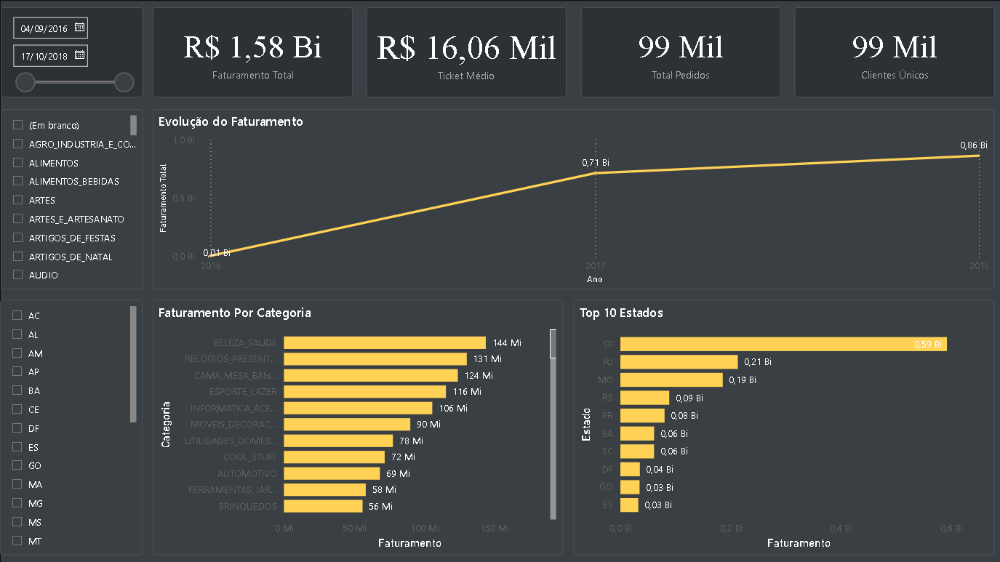

# E-commerce Sales Analysis

## Sobre o Projeto

Este projeto foi desenvolvido com o objetivo de construir uma solução completa de análise de vendas para um e-commerce utilizando SQL Server e Power BI.

A proposta do projeto é transformar dados brutos de vendas em informações analíticas capazes de apoiar tomadas de decisão comerciais e estratégicas.

---

# Problema de Negócio

Empresas de e-commerce geram grandes volumes de dados diariamente, porém dados brutos não geram valor diretamente.

Sem uma estrutura analítica adequada, torna-se difícil responder perguntas importantes como:

- Qual o faturamento total da empresa?
- Quais categorias vendem mais?
- Quais estados possuem maior volume de vendas?
- Como as vendas evoluem ao longo do tempo?
- Qual o ticket médio dos pedidos?
- Quantos clientes únicos compram na plataforma?

O projeto foi desenvolvido para resolver esse problema através da construção de um pipeline analítico completo.

---

# Solução Desenvolvida

Foi construída uma arquitetura de dados em camadas seguindo boas práticas de Data Warehouse:

```text
RAW → STG → DW → Power BI
```

O processo inclui:

- ingestão de dados
- limpeza e padronização
- modelagem dimensional
- criação de métricas analíticas
- construção de dashboard interativo

---

# Arquitetura do Projeto

## Camada RAW
Armazena os dados brutos originais.

## Camada STG (Staging)
Responsável pela limpeza e tratamento inicial dos dados.

## Camada DW (Data Warehouse)
Responsável pela modelagem analítica utilizando Star Schema.

---

# Modelo Dimensional

O modelo foi estruturado utilizando Star Schema.

## Tabela Fato
- fato_vendas

## Tabelas Dimensão
- dim_cliente
- dim_produto
- dim_data

---

# Tecnologias Utilizadas

- SQL Server
- Power BI
- DAX
- Data Warehouse
- Star Schema

---

# Métricas Desenvolvidas

- Faturamento Total
- Total de Pedidos
- Ticket Médio
- Clientes Únicos
- Frete Total
- Produtos Vendidos

---

# Dashboard

O dashboard foi desenvolvido para permitir análise interativa das vendas através de filtros por:

- período
- categoria
- estado

Principais análises disponíveis:

- evolução do faturamento
- categorias com maior faturamento
- vendas por estado
- indicadores comerciais

---

# Estrutura do Projeto

```text
ecommerce-sales-analysis
│
├── sql
│   ├── staging
│   ├── dw
│
├── powerbi
│
├── images
│
└── README.md
```

---

# Dashboard



---

# Modelo Star Schema


